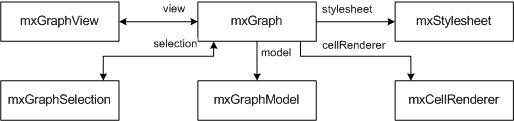

# my-mxGraph

* If you want the container to have scrollbars, use the __overflow:auto CSS__ directive instead of overflow:hidden in the style of the container.
* If you want the graph to be read-only you can use __graph.setEnabled(false)__.
* To create a new graph instance, a DOM node (typically a DIV) is required:
```javascript
    var node = document.getElementById('id-of-graph-container');
    var graph = new mxGraph(node);
```

